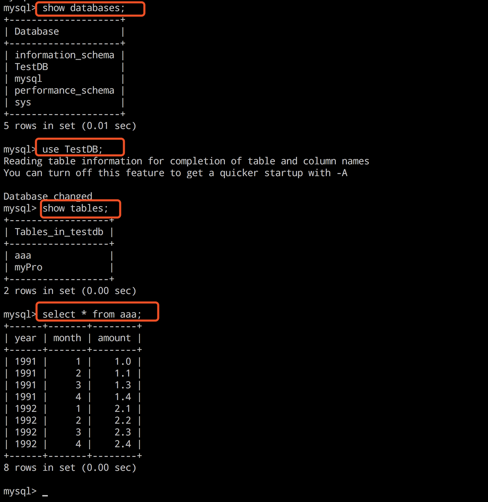
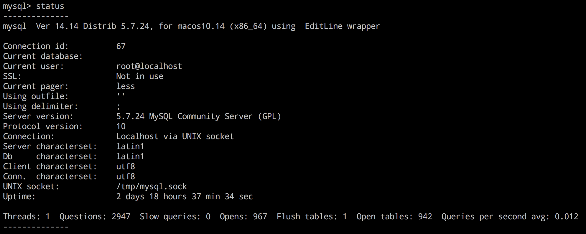
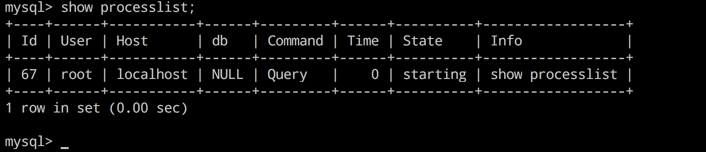

### 1.软链接和硬链接：

https://www.cnblogs.com/chenyongmou/p/7221399.html

表达式：ss ln 参数 源文件或目录 目标文件或目录

软链接：
1.软链接，以路径的形式存在。类似于Windows操作系统中的快捷方式
2.软链接可以 跨文件系统 ，硬链接不可以
3.软链接可以对一个不存在的文件名进行链接
4.软链接可以对目录进行链接

硬链接:
1.硬链接，以文件副本的形式存在。但不占用实际空间。
2.不允许给目录创建硬链接
3.硬链接只有在同一个文件系统中才能创建
这里有两点要注意：
第一，ln命令会保持每一处链接文件的同步性，也就是说，不论你改动了哪一处，其它的文件都会发生相同的变化；
第二，ln的链接又分软链接和硬链接两种，**软链接就是ln –s 源文件 目标文件**，它只会在你选定的位置上生成一个文件的镜像，不会占用磁盘空间，**硬链接 ln 源文件 目标文件，没有参数-s**， 它会在你选定的位置上生成一个和源文件大小相同的文件，无论是软链接还是硬链接，文件都保持同步变化。
ln指令用在链接文件或目录，如同时指定两个以上的文件或目录，且最后的目的地是一个已经存在的目录，则会把前面指定的所有文件或目录复制到该目录中。若同时指定多个文件或目录，且最后的目的地并非是一个已存在的目录，则会出现错误信息。


### 2.管道搜索：

Linux中的许多指令(如：grep、head、tail、wc、ls等)都可以当多管道符号使用

```
ls -l | wc //计算当前目录中文件数量 （Word count）

ls -l | head -5 //查看当前目录中的前5个文件

ls -l | head -30 | tail -5 //查看当前目录中第26至第30个文件

grep this apple.txt | grep was //在apple.txt中查找一行，该行出现”this”，并且出现”was”
```

https://blog.csdn.net/u010425776/article/details/52191292


### 3.怎么连接和查询使用数据库：

https://zhidao.baidu.com/question/1049475075846399659.html?fr=iks&word=mac%B0%B2%D7%B0mysql&ie=gbk

1.在终端输入mysql 路径命令：

PATH="$PATH":/usr/local/mysql/bin

2.在终端登录到Mysql命令下输入：

mysql -u root -p 

3.然后输入密码：zaq12wsx

4：


### 4.如何获取数据库的连接数：（以mysql为例）

1.status



2.show processlist；




