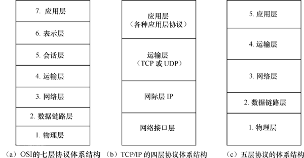

### **1.电梯测试**

http://www.voidcn.com/article/p-dmnlospf-bkx.html

**①确定测试范围**

**黑盒角度：**

功能：关注电梯的基本功能的实现

性能：关注电梯的性能指标，比如负重多少kg

安全性：关注电梯的安全性，比如超载报警，下坠制动

用户体验：关注电梯的舒适性

**白盒角度或者其他：**

效率：关注电梯控制逻辑的内部算法

接口：电梯和电梯控制器，电梯和大楼，电梯和摄像头，电梯和对讲机（报警装置）的接口测试

零件：电梯零件的单元测试

兼容性：电梯和其他东西的兼容性测试

**②具体测试用例设计**

3.1功能测试：

思路一：基于用户界面，如按钮，分电梯内的按钮和电梯外的按钮；电梯内分楼层键、开关门键、报警键。然后对这些键，一个一个测过来。同时关注显示屏，电梯内外的显示屏均显示电梯当前所在楼层和运行方向。

思路一就是典型的单元测试。

思路二：单个功能测好之后，再把单个的功能组合起来进行测试（集成测试），集成测试时可以根据电梯当前状态是上行、下行还是停止（状态机）来设计测试用例，以保证覆盖率。

比如上行时按XX按钮会怎么样。此时可以向面试官提出等价类划分思想，为何我要测这些按钮，如何划分等价类。

思路三：集成测试完毕后，开始测试真实用户场景（确认测试/验收测试/工作流测试），此时可以设计常见的用户场景（场景设计）并进行测试。如大量用户从1楼进入，并去不同楼层。又或者大量用户从不同楼层下到1楼。

思路四：不同品牌电梯的比较，电梯和电梯国际标准的比较，电梯和安装电梯的大楼用户需求的比较等等

思路五：特殊需求的测试，如摩天大楼可能要求高速电梯。百货大楼可能要求观光电梯。

3.2性能测试：

思路一：测试电梯负载单人时的运行情况（基准测试）、多人时的运行情况（负载测试）、一定人数下较长时间的运作（稳定性测试）、更长时间运作时的运行情况（疲劳测试）、不断增加人数导致电梯报警（拐点压力测试）

思路二：不同层次的性能，如零部件性能等

3.3安全性测试：

软件的安全性测试我也不了解。只能瞎说了。比如，暴力破坏电梯，下坠制动测试，超重警报、超时警报的测试，报警功能的测试，监控摄像头测试，断电，火灾时应该不让用户使用，但又要让里面的人能出来等等。

3.4用户体验：

电梯是否有地毯，夏天是否有空调，通风条件，照明条件。等等

3.5效率：调度算法是否合理，是否最优，按错键是否可以取消

3.6零件: 零部件是否合格

3.7接口：电梯和其他设备的交互，如报警装置、中央空调、监控室等等如何交互，是否工作正常

3.8兼容性：电梯的整体和其他设备的兼容性

### **2.测试效率的提高：**

https://blog.csdn.net/zhusongziye/article/details/78106484

https://www.cnblogs.com/linyfeng/p/7648157.html

1️⃣测试执行顺序

2️⃣先做冒烟测试，如果主流程不通直接打回去重做

3️⃣不做重复测试，先了解整个框架，了解相互之间的交互，当测试一个点有bug，可能和别的case看起来不一样但是根本问题可能是一个，这快就可以跳过。（还可以引入接口测试）

4️⃣不同版本的测试重点不同

### 3.Jenkins

https://www.cnblogs.com/onetwo/p/6423935.html

**①权限**

1️⃣插件管理

2️⃣权限管理

3️⃣管理组权限设置，构建权限设置

4️⃣用户权限分配

**②Job**

1️⃣创建Job

2️⃣开始构建

3️⃣构建完成

4️⃣查看错误

### 4.编写测试用例方法论

1️⃣等价划分法2️⃣边界值法3️⃣因果图法4️⃣正交法5️⃣错误推测6️⃣判定表7️⃣大纲发（拆分模块->再写测试用例）8️⃣场景法

正交法：

### 5.错误的6条基本法则

一功二可三易四效五维六移

功能，可靠性，易用性，效率，可维护性，移植性

### 6.测试分类：黑白灰

### 7.测试流程：

需求文档，需求评审，编写测试计划，计划评审，编写测试用例，测试用例评审，开始冒烟测试，迭代一轮，两轮，最后的测试报告。

### 8.测试原则：

100%覆盖需求

### 9.测试阶段：

单元，集成，系统，验收。

### 10.黑盒测试包含内容：

逆向思维测试，冒烟测试，易用性测试，兼容性测试，接口测试等

### 11.如何确认一个问题是否是bug：

​	根据需求，该功能的实现，实现方式不符合需求。

​	严重程度区分：

​	致命：系统奔溃，down机，内部接口错误，导致软件无法正常使用

​	严重级别：阻碍测试

​	一般：等价类，边界值，UI，小的功能错误不阻碍测试

​	轻微：不伤大雅，错别字，语法，

​	建议：不是bug是个人觉得有问题。

### 12.缺陷报告的准则:

简洁，清晰，准确，完整，一致。

### 13.表格题：

等价类，边界值，必填项，验证码点击换图，输入错误自动切换新的验证码，验证码不区分大小写，不勾选不能跳转，协议内容测试，默认提示语测试，

自我介绍：

1.干了多少年，上加公司做的什么项目，你在这个项目负责那一模块，我是怎么工作，表达，思维逻辑和态度。

### 14.Jmeter 参数化的方法和链接数据库：

​	并发=压力，负载测试，稳定性测试

​	网站最多能容纳多少人：负载测试

​	双十一活动，秒杀最多能承受大批量的并发：并发测试

​	网站在高强度下能否承受：稳定性测试方法（负载测试确定人数后，并能稳定执行）

​	

### 15.接口测试：（集成测试做接口测试）

​	Post 和Get的区别：

​		1.Get：服务器获取请求，快

​		2.Post：服务器发送请求，安全数据量大

​		3.Delete：服务器发送删除请求

​		4.Put（update）：服务器发送修改请求

​	工具：Jmeter，PostMan，SoupUI，接口压测：Jmeter （单接口用Jmeter）and LoadRunner（完整流程和性能过程，某个地方有并发）

​	接口测试能做哪些测试：任何的请求和方法是通过接口完成的（交换数据）

​	接口测试的测试范围：1.请求参数返回值，2.等价类，3，边界值，必填项 4，逻辑和功能和场景  5.支付和逆	向测试

### 16.集成测试策略：广度优先，深度优先，自顶向下，自低向上

### 17.TCP/IP协议：

##### TCP/IP四层模型：

**1.网络接口层（数据链路层/物理层）**：包括操作系统中的设备驱动程序、计算机中对应的网络接口卡

**2.网际层（互联网络层）**：处理分组在网络中的活动，比如分组的选路。

**3.运输层**：主要为两台主机上的应用提供端到端的通信。

**4.应用层**：负责处理特定的应用程序细节。

### 18.http的头信息：

HTTP请求报文由3部分组成（**请求行+请求头+请求体**）： 

①是请求方法，GET和POST是最常见的HTTP方法，除此以外还包括DELETE、HEAD、OPTIONS、PUT、TRACE。不过，当前的大多数浏览器只支持GET和POST，Spring 3.0提供了一个HiddenHttpMethodFilter，允许你通过“_method”的表单参数指定这些特殊的HTTP方法（实际上还是通过POST提交表单）。服务端配置了HiddenHttpMethodFilter后，Spring会根据_method参数指定的值模拟出相应的HTTP方法，这样，就可以使用这些HTTP方法对处理方法进行映射了。 

②为请求对应的URL地址，它和报文头的Host属性组成完整的请求URL，③是协议名称及版本号。 

④是HTTP的报文头，报文头包含若干个属性，格式为“属性名:属性值”，服务端据此获取客户端的信息。 

⑤是报文体，它将一个页面表单中的组件值通过param1=value1&param2=value2的键值对形式编码成一个格式化串，它承载多个请求参数的数据。不但报文体可以传递请求参数，请求URL也可以通过类似于“/chapter15/user.html? param1=value1&param2=value2”的方式传递请求参数。 

HTTP的响应报文也由三部分组成（**响应行+响应头+响应体**）： 

以下是一个实际的HTTP响应报文： 

 

①报文协议及版本； 
②状态码及状态描述； 
③响应报文头，也是由多个属性组成； 
④响应报文体，即我们真正要的“干货”。 

### 19.高内聚低耦合：

模块和模块之间的关系成为耦合；模块内的功能高度实现为聚合

起因：模块独立性指每个模块只完成系统要求的独立子功能，并且与其他模块的联系最少且接口简单，两个定性的度量标准――耦合性和内聚性。

​    耦合性也称块间联系。指软件系统结构中各模块间相互联系紧密程度的一种度量。模块之间联系越紧密，其耦合性就越强，模块的独立性则越差。模块间耦合高低取决于模块间接口的复杂性、调用的方式及传递的信息。

​    耦合性分类(低――高): 无直接耦合;数据耦合;标记耦合;控制耦合;公共耦合;内容耦合;

1 无直接耦合:

2 数据耦合: 指两个模块之间有调用关系，传递的是简单的数据值，相当于高级语言的值传递;

3 标记耦合: 指两个模块之间传递的是数据结构，如高级语言中的数组名、记录名、文件名等这些名字即标记，其实传递的是这个数据结构的地址;

4 控制耦合: 指一个模块调用另一个模块时，传递的是控制变量（如开关、标志等），被调模块通过该控制变量的值有选择地执行块内某一功能;

5 公共耦合: 指通过一个公共数据环境相互作用的那些模块间的耦合。公共耦合的复杂程序随耦合模块的个数增加而增加。

6 内容耦合: 这是最高程度的耦合，也是最差的耦合。当一个模块直接使用另一个模块的内部数据，或通过非正常入口而转入另一个模块内部。

 

​    内聚性又称块内联系。指模块的功能强度的度量，即一个模块内部各个元素彼此结合的紧密程度的度量。若一个模块内各元素（语名之间、程序段之间）联系的越紧密，则它的内聚性就越高。
​    内聚性匪类(低――高): 偶然内聚;逻辑内聚;时间内聚;通信内聚;顺序内聚;功能内聚;

1 偶然内聚: 指一个模块内的各处理元素之间没有任何联系。

2 逻辑内聚: 指模块内执行几个逻辑上相似的功能，通过参数确定该模块完成哪一个功能。

3 时间内聚: 把需要同时执行的动作组合在一起形成的模块为时间内聚模块。

4 通信内聚: 指模块内所有处理元素都在同一个数据结构上操作（有时称之为信息内聚），或者指各处理使用相同的输入数据或者产生相同的输出数据。

5 顺序内聚: 指一个模块中各个处理元素都密切相关于同一功能且必须顺序执行，前一功能元素输出就是下一功能元素的输入。

6 功能内聚: 这是最强的内聚，指模块内所有元素共同完成一个功能，缺一不可。与其他模块的耦合是最弱的。

 

​    耦合性与内聚性是模块独立性的两个定性标准，将软件系统划分模块时，尽量做到高内聚低耦合，提高模块的独立性，为设计高质量的软件结构奠定基础。

 

​    有个例子很容易明白：一个程序有50个函数，这个程序执行得非常好；然而一旦你修改其中一个函数，其他49个函数都需要做修改，这就是高耦合的后果。
一旦你理解了它，你编写概要设计的时候设计类或者模块自然会考虑到“高内聚，低耦合”。

